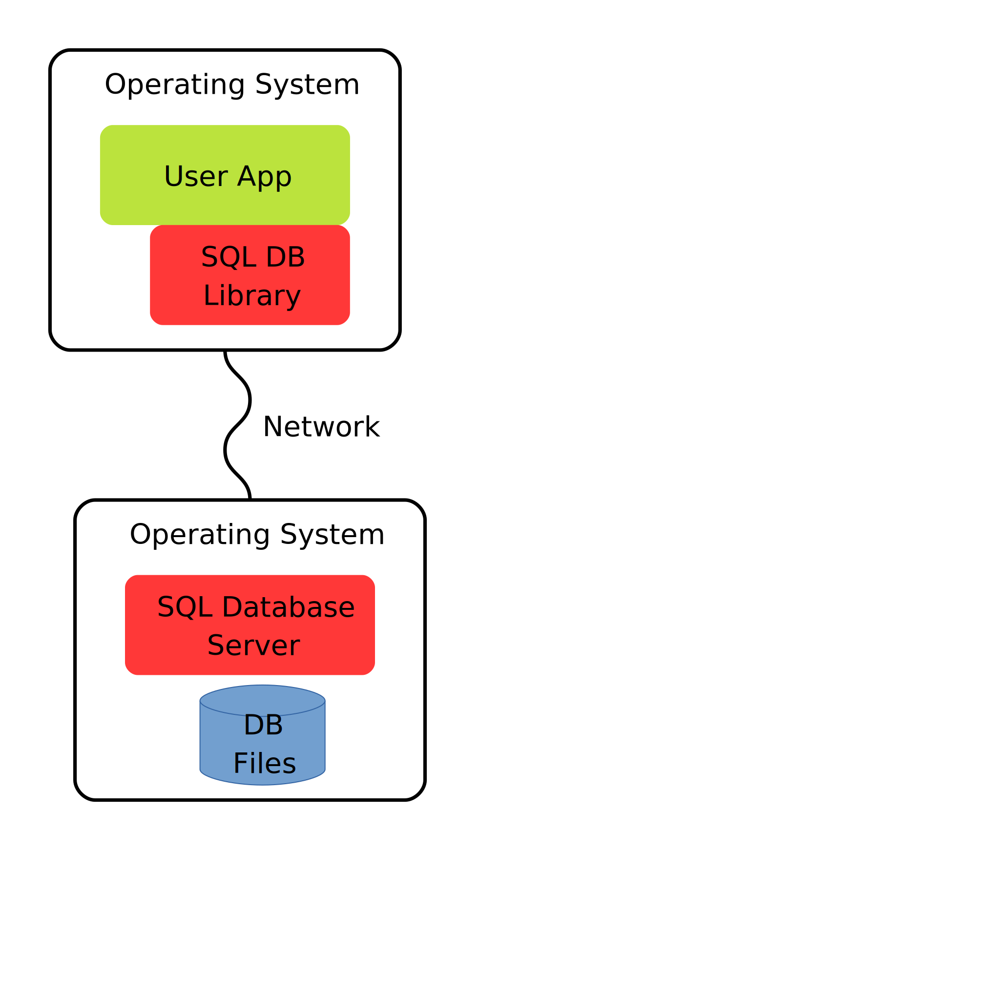
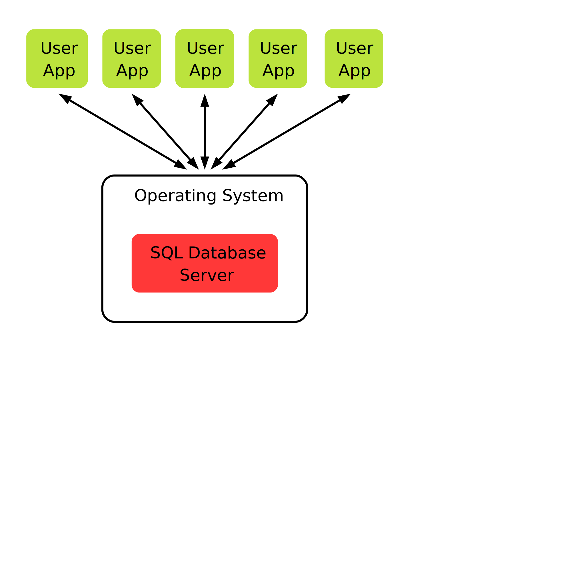
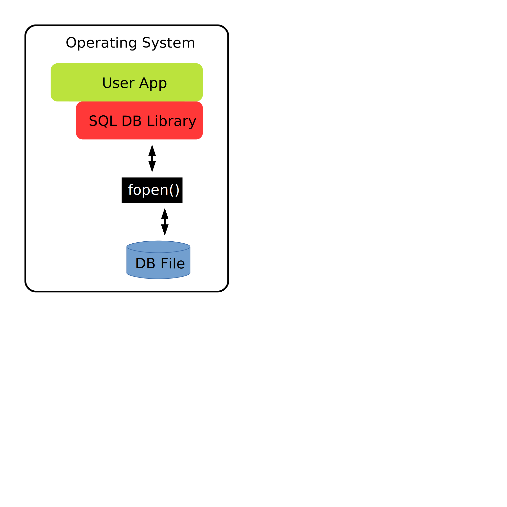
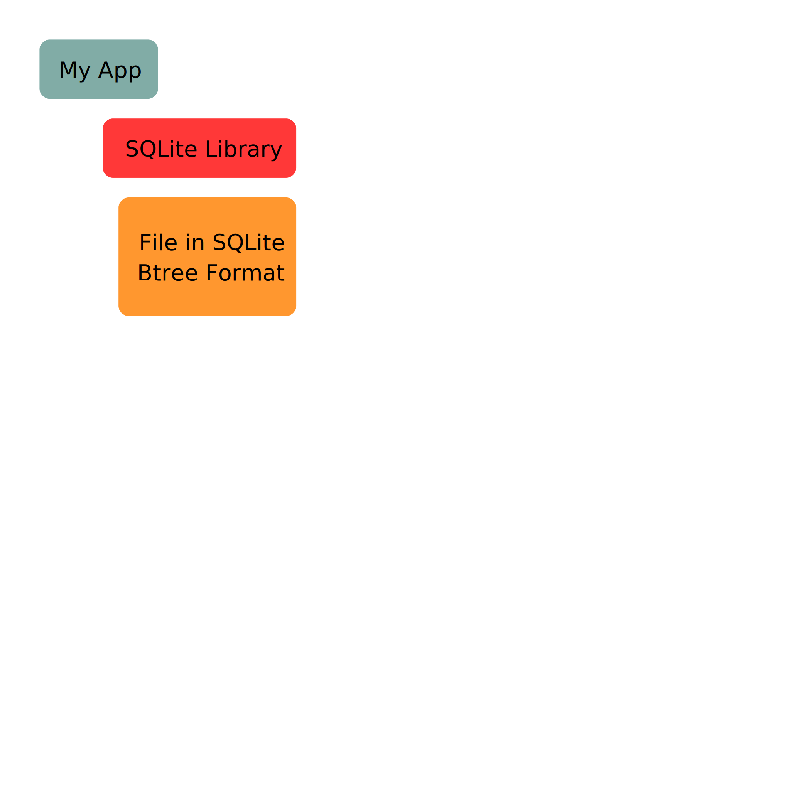
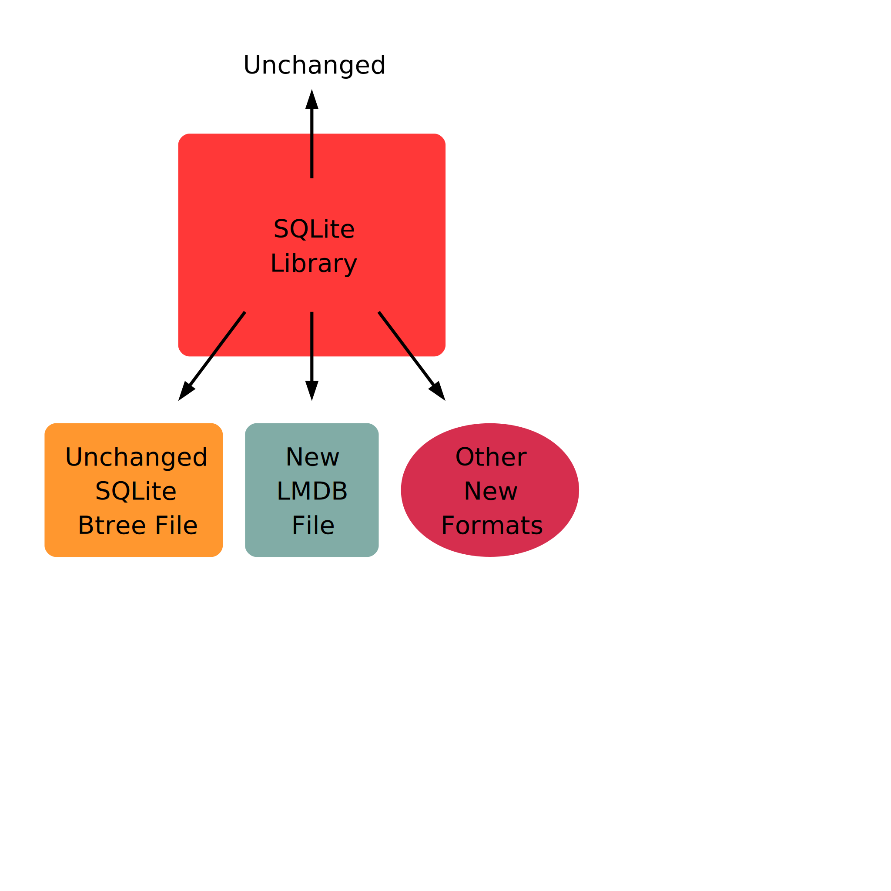

<!-- SPDX-License-Identifier: CC-BY-SA-4.0 -->
<!-- SPDX-FileCopyrightText: 2020 The LumoSQL Authors -->
<!-- SPDX-ArtifactOfProjectName: LumoSQL -->
<!-- SPDX-FileType: Documentation -->
<!-- SPDX-FileComment: Original by Dan Shearer, 2020 -->


Table of Contents
=================

   * [LumoSQL Architecture](#lumosql-architecture)
   * [Online Database Servers](#online-database-servers)
   * [SQLite as an Embedded Database](#sqlite-as-an-embedded-database)
  

LumoSQL Architecture
====================


# Online Database Servers

All of the most-used databases other than SQLite work over a network, here
called "online databases". This includes Postgresql, MariaDB, MySQL, SQLServer,
Oracle, and so on.



An online database server has clients that connect to the server over a
network. Once a network connection is opened, SQL queries are made by the
client and data is returned from the server. Although all databases use one of
the variants of the same SQL language, the means of connection is specific to each
database. 

For example, on a typical Debian Linux server there are these well-known ports:

```
foo@zanahoria:/etc$ grep sql /etc/services

ms-sql-s        1433/tcp                        # Microsoft SQL Server
ms-sql-m        1434/tcp                        # Microsoft SQL Monitor
mysql           3306/tcp                        # MySQL
postgresql      5432/tcp                        # PostgreSQL Database
mysql-proxy     6446/tcp                        # MySQL Proxy
```

with many other port assignments for other databases.

In the diagram above, each UserApp has a network connection to the SQL Database
Server on TCP port, for example 5432 if it is Postgresql. The UserApps could be
running from anywhere on the internet, including on mobile devices. There is a
limit to how many users one single database server can serve, in the many
thousands at least, but often reached for internet applications.



The most obvious way to scale an online database is to add more RAM, CPU and storage to a single server. This way all code runs in a single address space and is called "Scaling Up". The alternative is to add more servers, and distribute queries between them. This is called "Scale Out".

Nati Shalom describes the difference in the [article Scale-Out vs Scale-Up](http://ht.ly/cAhPe):

> One of the common ways to best utilize multi-core architecture in a context
> of a single application is through concurrent programming. Concurrent
> programming on multi-core machines (scale-up) is often done through
> multi-threading and in-process message passing also known as the Actor
> model.Distributed programming does something similar by distributing jobs
> across machines over the network. There are different patterns associated
> with this model such as Master/Worker, Tuple Spaces, BlackBoard, and
> MapReduce. This type of pattern is often referred to as scale-out
> (distributed).
>
> Conceptually, the two models are almost identical as in both cases we break a
> sequential piece of logic into smaller pieces that can be executed in
> parallel. Practically, however, the two models are fairly different from an
> implementation and performance perspective. The root of the difference is the
> existence (or lack) of a shared address space. In a multi-threaded scenario
> you can assume the existence of a shared address space, and therefore data
> sharing and message passing can be done simply by passing a reference. In
> distributed computing, the lack of a shared address space makes this type of
> operation significantly more complex. Once you cross the boundaries of a
> single process you need to deal with partial failure and consistency. Also,
> the fact that you can’t simply pass an object by reference makes the process
> of sharing, passing or updating data significantly more costly (compared with
> in-process reference passing), as you have to deal with passing of copies of
> the data which involves additional network and serialization and
> de-serialization overhead.

# SQLite as an Database Library

The user applications are tightly connected to the SQLite library. Whether by
dynamic linking to a copy of the library shared across the whole operating
system, or static linking so that it is part of the same program as the user
application, there is no networking involved. Making an SQL query and getting a
response involves a cascade of function calls from the app to the library to
the operating system and back again, typically taking less than 10 milliseconds
at most depending on the hardware used. An online database cannot expect to get
faster results than 100 milliseconds, often much more depending on network and
hardware. And online database relies on the execution of hundreds of millions
of more lines of code on at least two computers, whereas SQLite relies on the
execution of some hundreds of thousand on just one computer.









